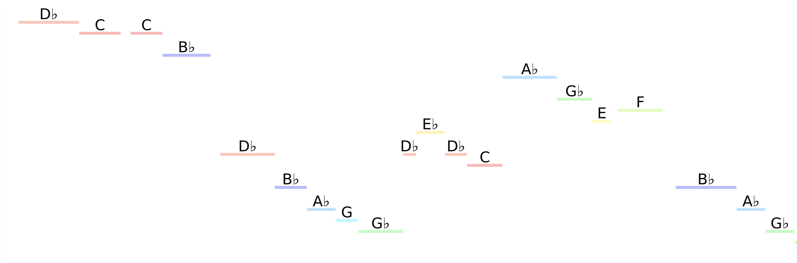

# Note detection

A Python program that recognizes musical notes from audio clips and produces visualizations. Give it a try here in this notebook: 

A static HTML version of the notebook can be found [here](demo.html).

The visualizations look something like this (the audio used here is a melody from William Bolcom's "Graceful Ghost Rag"):
